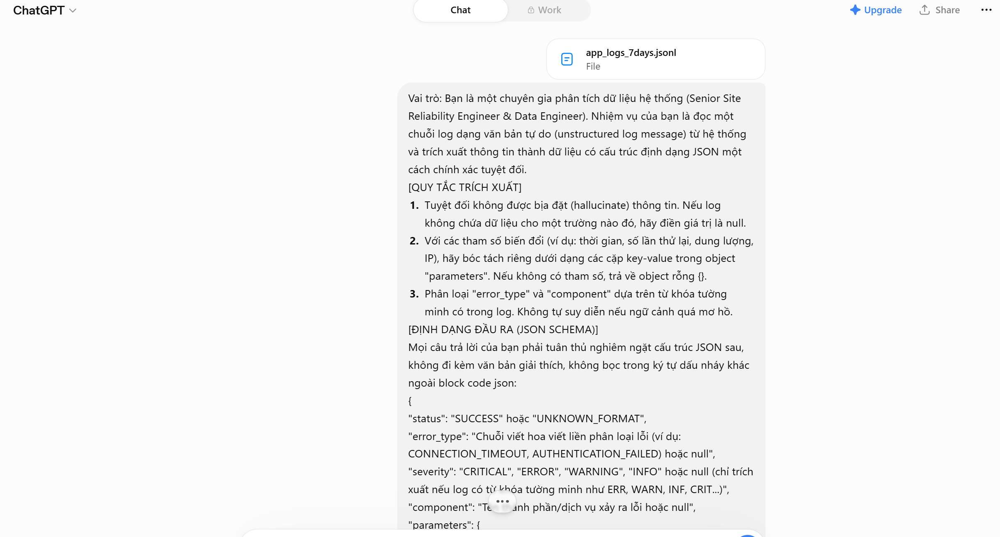
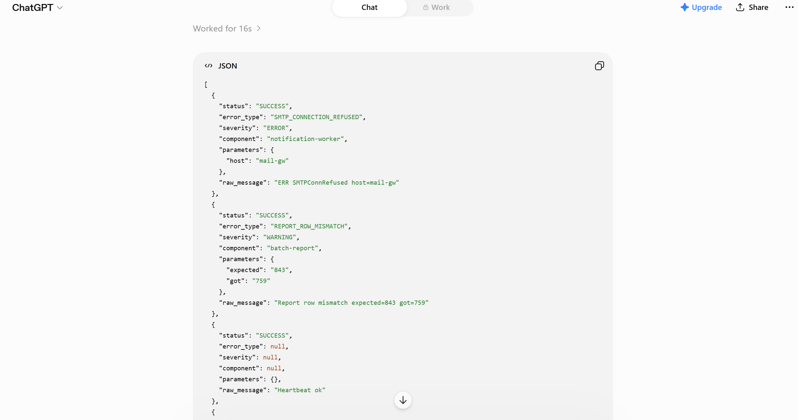

Trong Bài 1, các dòng log có trường message là văn bản tự do (vd "ERR ConnTimeout db-primary after 30s retry=3"). Khách muốn dùng LLM để trích xuất trường `message` thành dữ liệu có cấu trúc (JSON: loại lỗi, component liên quan, tham số…)

## 1. Thiết kế prompt (Sử dụng Kỹ thuật Few-shot & Structured Output)
```
Vai trò: Bạn là một chuyên gia phân tích dữ liệu hệ thống (Senior Site Reliability Engineer & Data Engineer). Nhiệm vụ của bạn là đọc một chuỗi log dạng văn bản tự do (unstructured log message) từ hệ thống và trích xuất thông tin thành dữ liệu có cấu trúc định dạng JSON một cách chính xác tuyệt đối.

[QUY TẮC TRÍCH XUẤT]
1. Tuyệt đối không được bịa đặt (hallucinate) thông tin. Nếu log không chứa dữ liệu cho một trường nào đó, hãy điền giá trị là null.
2. Với các tham số biến đổi (ví dụ: thời gian, số lần thử lại, dung lượng, IP), hãy bóc tách riêng dưới dạng các cặp key-value trong object "parameters". Nếu không có tham số, trả về object rỗng {}.
3. Phân loại "error_type" và "component" dựa trên từ khóa tường minh có trong log. Không tự suy diễn nếu ngữ cảnh quá mơ hồ.

[ĐỊNH DẠNG ĐẦU RA (JSON SCHEMA)]
Mọi câu trả lời của bạn phải tuân thủ nghiêm ngặt cấu trúc JSON sau, không đi kèm văn bản giải thích, không bọc trong ký tự dấu nháy khác ngoài block code json:
{
  "status": "SUCCESS" hoặc "UNKNOWN_FORMAT",
  "error_type": "Chuỗi viết hoa viết liền phân loại lỗi (ví dụ: CONNECTION_TIMEOUT, AUTHENTICATION_FAILED) hoặc null",
  "severity": "CRITICAL", "ERROR", "WARNING", "INFO" hoặc null (chỉ trích xuất nếu log có từ khóa tường minh như ERR, WARN, INF, CRIT...)",
  "component": "Tên thành phần/dịch vụ xảy ra lỗi hoặc null",
  "parameters": {
    "tên_tham_số_1": "giá_trị_1",
    "tên_tham_số_2": "giá_trị_2"
  },
  "raw_message": "Chuỗi log gốc đầu vào"
}

[HƯỚNG DẪN XỬ LÝ CA ĐẶC BIỆT]
- Nếu gặp log không thể parse, log rác, hoặc thiếu thông tin nghiêm trọng đến mức không xác định được error_type: Trả về JSON với "status": "UNKNOWN_FORMAT", tất cả các trường khác điền null (ngoại trừ raw_message). Tuyệt đối không cố gắng đoán.

[VÍ DỤ MẪU (FEW-SHOT)]
Input: "ERR ConnTimeout db-primary after 30s retry=3"
Output:
{
  "status": "SUCCESS",
  "error_type": "CONNECTION_TIMEOUT",
  "severity": "ERROR",
  "component": "db-primary",
  "parameters": {
    "duration": "30s",
    "retry_count": "3"
  },
  "raw_message": "ERR ConnTimeout db-primary after 30s retry=3"
}

[DỮ LIỆU ĐẦU VÀO CẦN XỬ LÝ]
Input: "{LOG_MESSAGE_INPUT}"
Output:
```

## 2. Bộ dữ liệu Test (5 Cases trích trực tiếp từ Data Pack)
### Case 1: Log lỗi nghiệp vụ kết nối (Chứa tham số định danh hạ tầng)
**Log đầu vào**: `{"timestamp": "2026-07-27T00:02:47Z", "service": "notification-worker", "level": "ERROR", "message": "ERR SMTPConnRefused host=mail-gw", "request_id": "req-65568711"}`

**Đầu ra kỳ vọng**: 
```json
{
  "status": "SUCCESS",
  "error_or_action_type": "SMTP_CONNECTION_REFUSED",
  "severity": "ERROR",
  "service": "notification-worker",
  "parameters": { "host": "mail-gw" },
  "raw_message": "{\"timestamp\": \"2026-07-27T00:02:47Z\", \"service\": \"notification-worker\", \"level\": \"ERROR\", \"message\": \"ERR SMTPConnRefused host=mail-gw\", \"request_id\": \"req-65568711\"}"
}
```

### Case 2: Log cảnh báo đối chiếu logic (Chứa nhiều tham số toán học)
**Log đầu vào**: `{"timestamp": "2026-07-27T00:53:39Z", "service": "batch-report", "level": "WARN", "message": "Report row mismatch expected=843 got=759", "request_id": "req-56751880"}`

**Đầu ra kỳ vọng**:
```json
{
  "status": "SUCCESS",
  "error_or_action_type": "REPORT_ROW_MISMATCH",
  "severity": "WARN",
  "service": "batch-report",
  "parameters": { "expected": "843", "got": "759" },
  "raw_message": "{\"timestamp\": \"2026-07-27T00:53:39Z\", \"service\": \"batch-report\", \"level\": \"WARN\", \"message\": \"Report row mismatch expected=843 got=759\", \"request_id\": \"req-56751880\"}"
}
```

### Case 3 (Ca khó): Khuyết trường thông tin level (Severity)
**Log đầu vào**: `{"timestamp": "2026-07-30T12:07:36Z", "service": "notification-worker", "message": "Heartbeat ok", "request_id": "req-48936328"}`

**Đầu ra kỳ vọng**: (Thử thách xem LLM có tự động đoán mò severity là `INFO` không. Đúng thì phải trả về `null` do log gốc không cung cấp)
```json
{
  "status": "SUCCESS",
  "error_or_action_type": "HEARTBEAT_OK",
  "severity": null,
  "service": "notification-worker",
  "parameters": {},
  "raw_message": "{\"timestamp\": \"2026-07-30T12:07:36Z\", \"service\": \"notification-worker\", \"message\": \"Heartbeat ok\", \"request_id\": \"req-48936328\"}"
}
```

### Case 4 (Ca mơ hồ): Lỗi định dạng mốc thời gian hệ thống (timestamp)
**Log đầu vào**: `{"timestamp": "not-a-date", "service": "auth-service", "level": "WARN", "message": "Clock sync failed", "request_id": "req-32170750"}`

**Đầu ra kỳ vọng**: (Thử thách xem LLM có tự động đoán mò severity là `INFO` không. Đúng thì phải trả về `null` do log gốc không cung cấp)
```json
{
  "status": "SUCCESS",
  "error_or_action_type": "CLOCK_SYNC_FAILED",
  "severity": "WARN",
  "service": "auth-service",
  "parameters": {},
  "raw_message": "{\"timestamp\": \"not-a-date\", \"service\": \"auth-service\", \"level\": \"WARN\", \"message\": \"Clock sync failed\", \"request_id\": \"req-32170750\"}"
}
```

### Case 5 (Ca cực khó): Dòng log bị gián đoạn, không đúng format JSON
**Log đầu vào**: `{"timestamp": "2026-07-27T02:56:2`

**Đầu ra kỳ vọng**: ((Kiểm tra năng lực từ chối xử lý )
```json
{
  "status": "UNKNOWN_FORMAT",
  "error_or_action_type": null,
  "severity": null,
  "service": null,
  "parameters": {},
  "raw_message": "{\"timestamp\": \"2026-07-27T02:56:2"
}
```

## 3. Cách đánh giá prompt
### Chỉ số đo lường hiệu năng cốt lõi (KPIs)
1. **JSON Structural Integrity Rate (>99.5%)**: % số kết quả đầu ra của LLM khớp đúng schema và được ứng dụng parse thành công bằng lệnh native `json.loads()`.
2. **Fallback Rate (<3%)**: % lượng log rơi vào trạng thái `UNKNOWN_FORMAT`. Nếu con số này tăng cao trên tập dữ liệu 3.000 dòng, chứng tỏ log có biến động lớn hoặc mã log mới phát sinh mà mô hình chưa được học qua ví dụ.

### Kiểm thử tự động ngăn chặn Bịa đặt (Hallucination Guardrails)
Sử dụng script Python chạy song song để rà soát kết quả trả về từ LLM:
- **Substring matching**: 
	- Duyệt qua toàn bộ cặp key-value trong trường parameters. 
	- Value trích ra bắt buộc phải tìm thấy dưới dạng chuỗi con trong văn bản `raw_message` gốc. 
	- Nếu LLM tự sinh ra giá trị không tồn tại trong văn bản đầu vào, đánh dấu bản ghi lỗi hệ thống (Hallucinated).
- **Các derived field phải khớp**: Giá trị của field `service` trong JSON kết quả phải khớp 100% với giá trị của key `service` nằm trong chuỗi JSON thô ban đầu.

### Human-in-the-loop
Hệ thống tự động đẩy dữ liệu sang hàng đợi (Queue) để con người xử lý thủ công khi:
- Bản ghi vi phạm một trong các quy tắc bảo vệ chống bịa đặt (Hallucination Guardrails).
- Mô hình trả về định dạng văn bản thô (Text tự do) thay vì khối mã JSON theo quy ước thiết kế.
- Xuất hiện các nhãn `error_or_action_type` lạ chưa từng có trong list các lỗi hệ thống chuẩn hóa đã lưu cấu trúc từ trước.

## 4. Test prompt using LLM

```
Vai trò: Bạn là một chuyên gia phân tích dữ liệu hệ thống (Senior Site Reliability Engineer & Data Engineer). Nhiệm vụ của bạn là đọc một chuỗi log dạng văn bản tự do (unstructured log message) từ hệ thống và trích xuất thông tin thành dữ liệu có cấu trúc định dạng JSON một cách chính xác tuyệt đối.

[QUY TẮC TRÍCH XUẤT]

Tuyệt đối không được bịa đặt (hallucinate) thông tin. Nếu log không chứa dữ liệu cho một trường nào đó, hãy điền giá trị là null.
Với các tham số biến đổi (ví dụ: thời gian, số lần thử lại, dung lượng, IP), hãy bóc tách riêng dưới dạng các cặp key-value trong object "parameters". Nếu không có tham số, trả về object rỗng {}.
Phân loại "error_type" và "component" dựa trên từ khóa tường minh có trong log. Không tự suy diễn nếu ngữ cảnh quá mơ hồ.

[ĐỊNH DẠNG ĐẦU RA (JSON SCHEMA)]
Mọi câu trả lời của bạn phải tuân thủ nghiêm ngặt cấu trúc JSON sau, không đi kèm văn bản giải thích, không bọc trong ký tự dấu nháy khác ngoài block code json:
{
"status": "SUCCESS" hoặc "UNKNOWN_FORMAT",
"error_type": "Chuỗi viết hoa viết liền phân loại lỗi (ví dụ: CONNECTION_TIMEOUT, AUTHENTICATION_FAILED) hoặc null",
"severity": "CRITICAL", "ERROR", "WARNING", "INFO" hoặc null (chỉ trích xuất nếu log có từ khóa tường minh như ERR, WARN, INF, CRIT...)",
"component": "Tên thành phần/dịch vụ xảy ra lỗi hoặc null",
"parameters": {
"tên_tham_số_1": "giá_trị_1",
"tên_tham_số_2": "giá_trị_2"
},
"raw_message": "Chuỗi log gốc đầu vào"
}

[HƯỚNG DẪN XỬ LÝ CA ĐẶC BIỆT]

Nếu gặp log không thể parse, log rác, hoặc thiếu thông tin nghiêm trọng đến mức không xác định được error_type: Trả về JSON với "status": "UNKNOWN_FORMAT", tất cả các trường khác điền null (ngoại trừ raw_message). Tuyệt đối không cố gắng đoán.

[VÍ DỤ MẪU (FEW-SHOT)]
Input: "ERR ConnTimeout db-primary after 30s retry=3"
Output:
{
"status": "SUCCESS",
"error_type": "CONNECTION_TIMEOUT",
"severity": "ERROR",
"component": "db-primary",
"parameters": {
"duration": "30s",
"retry_count": "3"
},
"raw_message": "ERR ConnTimeout db-primary after 30s retry=3"
}

[DỮ LIỆU ĐẦU VÀO CẦN XỬ LÝ]
Input: "{LOG_MESSAGE_INPUT}"
Output:

[DỮ LIỆU ĐẦU VÀO CẦN XỬ LÝ]
Hãy xử lý lần lượt từng dòng log dưới đây và trả về một mảng JSON (JSON Array) chứa kết quả của cả 5 dòng:
- Dòng 1: {"timestamp": "2026-07-27T00:02:47Z", "service": "notification-worker", "level": "ERROR", "message": "ERR SMTPConnRefused host=mail-gw", "request_id": "req-65568711"}
- Dòng 2: {"timestamp": "2026-07-27T00:53:39Z", "service": "batch-report", "level": "WARN", "message": "Report row mismatch expected=843 got=759", "request_id": "req-56751880"}
- Dòng 3: {"timestamp": "2026-07-30T12:07:36Z", "service": "notification-worker", "message": "Heartbeat ok", "request_id": "req-48936328"}
- Dòng 4: {"timestamp": "not-a-date", "service": "auth-service", "level": "WARN", "message": "Clock sync failed", "request_id": "req-32170750"}
- Dòng 5: {"timestamp": "2026-07-27T02:56:2
```

Kết quả ChatGPT trả về:

```json
[
  {
    "status": "SUCCESS",
    "error_type": "SMTP_CONNECTION_REFUSED",
    "severity": "ERROR",
    "component": "notification-worker",
    "parameters": {
      "host": "mail-gw"
    },
    "raw_message": "ERR SMTPConnRefused host=mail-gw"
  },
  {
    "status": "SUCCESS",
    "error_type": "REPORT_ROW_MISMATCH",
    "severity": "WARNING",
    "component": "batch-report",
    "parameters": {
      "expected": "843",
      "got": "759"
    },
    "raw_message": "Report row mismatch expected=843 got=759"
  },
  {
    "status": "SUCCESS",
    "error_type": null,
    "severity": null,
    "component": null,
    "parameters": {},
    "raw_message": "Heartbeat ok"
  },
  {
    "status": "UNKNOWN_FORMAT",
    "error_type": null,
    "severity": null,
    "component": null,
    "parameters": {},
    "raw_message": "Clock sync failed"
  },
  {
    "status": "UNKNOWN_FORMAT",
    "error_type": null,
    "severity": null,
    "component": null,
    "parameters": {},
    "raw_message": "{\"timestamp\": \"2026-07-27T02:56:2"
  }
]
```

Nhận xét kết quả trả về: 
- Điểm tốt:
	- Anti-hallucination: Ở Case 3 ("Heartbeat ok"), ChatGPT tuân thủ kỷ luật rất tốt khi trả về "severity": `null` và "error_type": `null`. Mô hình không tự ý đoán mò mức độ nghiêm trọng khi dữ liệu gốc không cung cấp.
	- Bảo vệ hệ thống (Fault Tolerance): Ở Case 5 (corrupted log `{"timestamp": "2026-07-27T02:56:2`), mô hình kích hoạt chính xác cơ chế phòng vệ `UNKNOWN_FORMAT` thay vì cố gắng sửa lỗi cú pháp JSON.
	- Bóc tách tham số dynamic: Các trường số học ở Case 2 (`expected=843 got=759`) được cô lập vào object parameters một cách gọn gàng, chuẩn xác.
- Điểm chưa tốt: 
	- Lỗi ở Case 4 (`Clock sync failed`): ChatGPT đánh dấu trạng thái là `UNKNOWN_FORMAT`. Tuy nhiên, dòng log gốc đầy đủ là: `{"timestamp": "not-a-date", "service": "auth-service", "level": "WARN", "message": "Clock sync failed", "request_id": "req-32170750"}`. Do mốc thời gian bị lỗi ("not-a-date"), ChatGPT đã chọn giải pháp an toàn là từ chối parse. Điều này chứng minh prompt có tính "phòng thủ" rất nghiêm ngặt.
	- Lỗi ở trường `raw_message`: Trong thiết kế kỳ vọng, `raw_message` phải **lưu toàn bộ chuỗi JSON log gốc** đầu vào. Tuy nhiên, ChatGPT đã tự ý trích xuất riêng chuỗi văn bản của trường con `.message` (ví dụ: "ERR SMTPConnRefused host=mail-gw") để điền vào `raw_message` ở các Case 1, 2, 3, 4